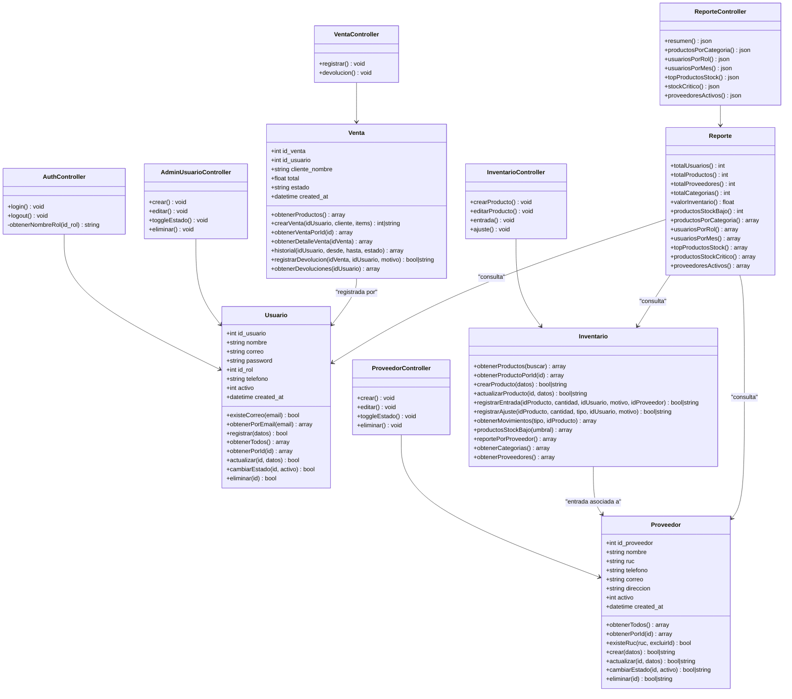
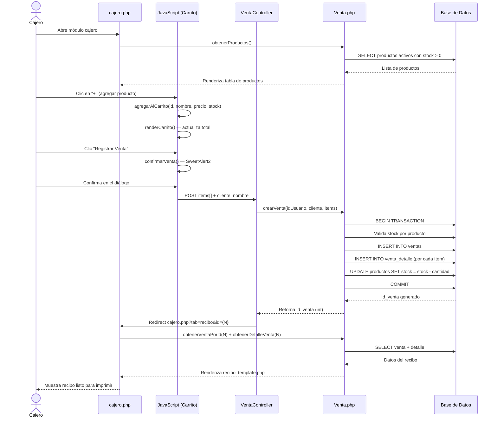
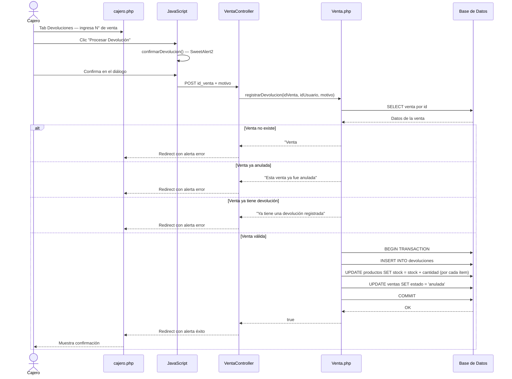
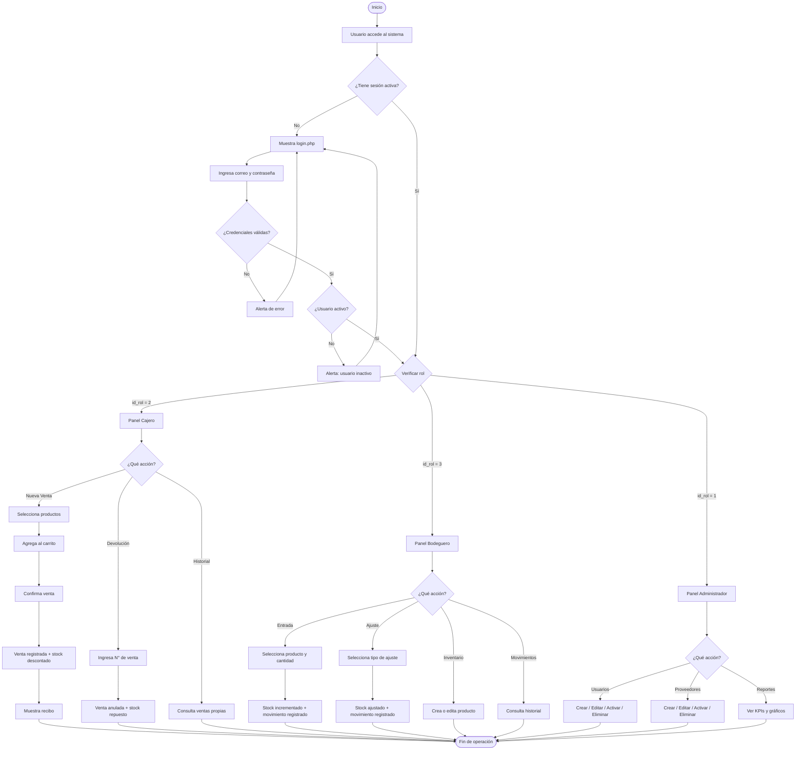
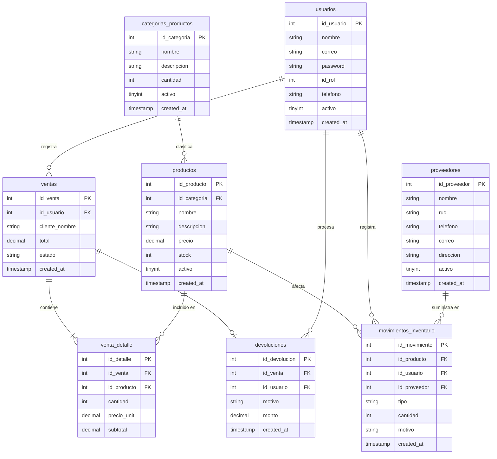

# Diagramas UML — Celeste Boutique

> Todos los diagramas están escritos en **Mermaid**. Se renderizan automáticamente en GitHub, GitLab y en la extensión **Markdown Preview Mermaid Support** de VS Code.

---

## 1. Diagrama de Casos de Uso

```mermaid
flowchart TD
    subgraph Actores
        U1(["👤 Cajero"])
        U2(["👤 Bodeguero"])
        U3(["👤 Administrador"])
    end

    subgraph Sistema Celeste Boutique
        %% Casos de uso comunes
        CU0([Iniciar Sesión])

        %% Cajero
        CU1([Registrar Venta])
        CU2([Agregar Productos al Carrito])
        CU3([Procesar Devolución])
        CU4([Imprimir Recibo])
        CU5([Consultar Historial de Ventas])

        %% Bodeguero
        CU6([Gestionar Productos])
        CU7([Registrar Entrada de Mercancía])
        CU8([Registrar Ajuste de Inventario])
        CU9([Consultar Movimientos])
        CU10([Ver Reportes de Stock])

        %% Administrador
        CU11([Gestionar Usuarios])
        CU12([Crear / Editar Usuario])
        CU13([Activar / Desactivar Usuario])
        CU14([Gestionar Proveedores])
        CU15([Ver Reportes y Estadísticas])
    end

    U1 --> CU0
    U2 --> CU0
    U3 --> CU0

    U1 --> CU1
    CU1 --> CU2
    U1 --> CU3
    U1 --> CU4
    U1 --> CU5

    U2 --> CU6
    U2 --> CU7
    U2 --> CU8
    U2 --> CU9
    U2 --> CU10

    U3 --> CU11
    CU11 --> CU12
    CU11 --> CU13
    U3 --> CU14
    U3 --> CU15
    U3 --> CU6
    U3 --> CU1
```

---

## 2. Diagrama de Clases

---

## 3. Diagrama de Secuencia — Registrar Venta

---

## 4. Diagrama de Secuencia — Registrar Devolución

---

## 5. Diagrama de Actividades — Flujo General del Sistema

---

## 6. Diagrama de Tablas / Entidades (MER)

